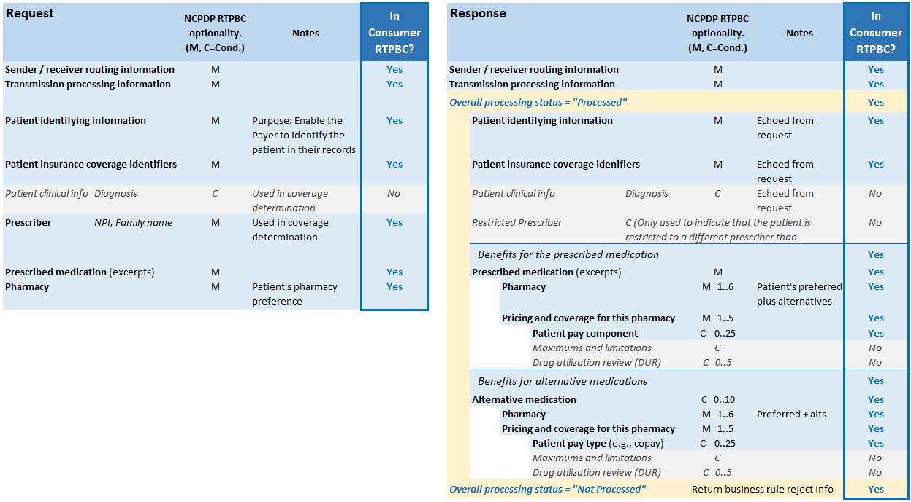

[Previous Page](Security.html)

The consumer Real-time Prescription Benefit Check (RTPBC) profile is an adaptation of an existing NCPDP standard which was designed for use in provider systems. That specification includes content such as drug utilization review (DUR) alerts and detailed adjudication information to inform a provider's prescribing process.
  
In contrast, this patient-focused version of RTPBC aims to include only the coverage and cost information that is useful and meaningful to patients.
  
The table below summarizes the structure and content of the NCPDP real-time pharmacy benefit check transactions, on which consumer RTPBC is based, and which of those are pertinent in the consumer version.

* The element names, optionality and notes refer to the NCPDP transactions
* The Consumer Facing column indicates the content carried over to the consumer version described in this implementation guide.

 
 

  