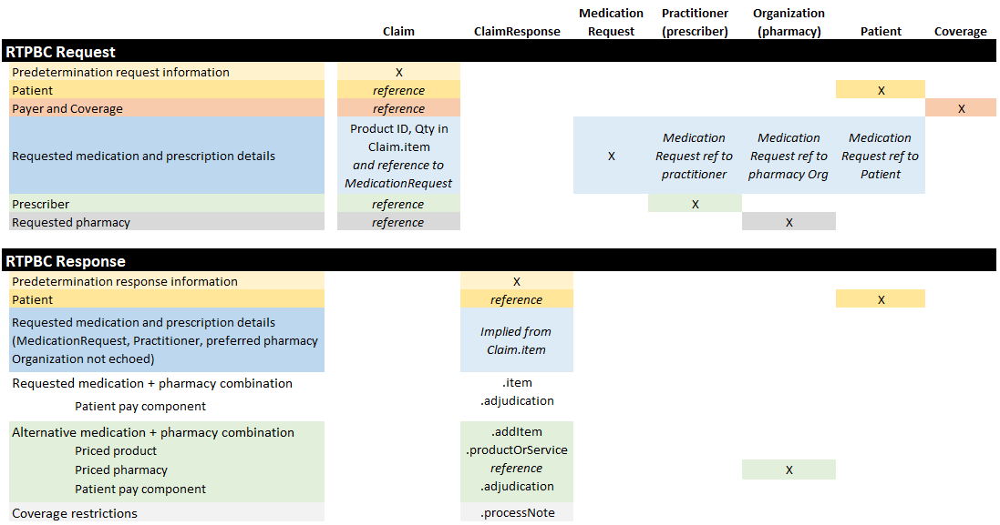

[Previous Page](Use_cases.html)

The real-time pharmacy benefit check (RTPBC) process involves a request from a consumer application used by a patient to either (a) the party that manages the pharmacy benefit portion of the patient's health insurance or (b) a party that serves as a source for typical and discount medication pricing information. 

 

### Content when submitting to the patient's insurer
#### *Request content*
The patient application submits a request containing...
* basic patient identifying information
* payer and coverage identifiers
* information from the prescription for which coverage and cost is desired
* the patient's preferred pharmacy

*Example:* <a href="Bundle-rtpbc-bundle-request-03.html">Bundled RTPBC request</a>

#### *Response content*
The responder... 
* locates the patient's record and coverage details
* determines the patient's out of pocket cost for the requested pharmacy and potentially other pharmacy options
* determines if alternative medications are available and identifies coverage and cost for those
* returns the gathered information to requester

*Example:* <a href="Bundle-rtpbc-bundle-response-03.html">Bundled RTPBC response from payer/PBM</a>

 

### Content when submitting to a medication pricing source
#### *Request content*
The patient application submits a request containing...
* information from the prescription for which pricing is desired
* the patient's location and preferred pharmacy
 

#### *Response content*
The responder... 
* determines pricing for the requested pharmacy and potentially other nearby pharmacies, including discounts associated with coupons or memberships
* returns the gathered information to requester

 
 

### Resources used in the exchange
The consumer RTPBC request and response are accomplished using FHIR&reg; **Claim** and **ClaimResponse** resources in a "predetermination" (what-if) mode. Other FHIR&reg; resources support the exchange by fleshing out patient, prescription, pharmacy and coverage information needed to determine accurate cost and coverage. An OperationOutcome communicates exception situations where a ClaimResponse cannot be returned

 

Below are profiles constraining those resources for this purpose:

* **Claim** - Represents the RTPBC request. Uses the *predetermination* Claim.use mode  
* **ClaimResponse** - Represents the RTPBC response
* **Patient** - Conveys the patient information needed for the exchange
* **MedicationRequest** - Conveys the needed prescription information (a subset of what is present in a full prescription)
* **Practitioner** - Conveys the prescriber information needed for the exchange
* **Organization *(Pharmacy)*** - Conveys pharmacy information needed for the exchange 
* **Coverage** - Conveys the patient's pharmacy benefit coverage IDs 

 

[Next Page](Submission_method.html)